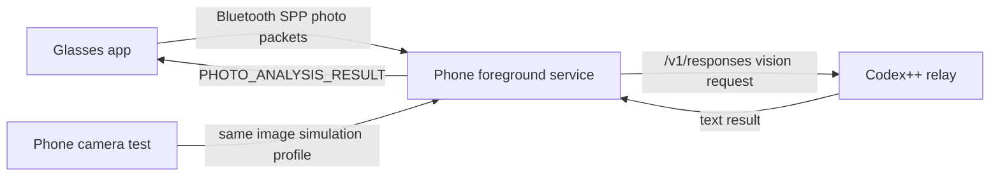

# Architecture

The current project is intentionally narrow: Rokid glasses capture a photo, the phone sends it to a Codex++ relay with a saved prompt, and the result is displayed on the glasses.

## Components



## Modules

- `common`: message types, constants, binary photo packet helpers, integration tests.
- `phone-app`: Compose control panel, foreground Bluetooth SPP server, chunked photo receiver, Codex relay client, prompt/settings storage.
- `glasses-app`: Compose glasses UI, Bluetooth SPP client, camera capture, image compression, chunked sender, result pagination.
- `app`: upstream integrated reference app, excluded from Gradle builds.

## Protocol

Control messages are JSON messages over the SPP stream. Large photos use the binary photo packet protocol.

Kept message types:

- `HANDSHAKE`
- `HEARTBEAT`
- `HEARTBEAT_ACK`
- `AI_PROCESSING`
- `AI_ERROR`
- `DISPLAY_TEXT`
- `DISPLAY_CLEAR`
- `CAPTURE_PHOTO`
- `PHOTO_START`
- `PHOTO_DATA`
- `PHOTO_END`
- `PHOTO_ACK`
- `PHOTO_RETRY`
- `PHOTO_ANALYSIS_RESULT`

Photo packet defaults:

```text
Target image: 1280x720 max fit
JPEG quality: 70
Max compressed size target: 200 KB
Chunk size: 4096 bytes
Transfer timeout: 60 s
ACK timeout: 5 s
```

## Runtime Flow

1. Phone starts `PhoneAIService` as a foreground service and listens for Bluetooth SPP.
2. Glasses connect to the paired phone.
3. User triggers capture on glasses, or the phone sends `CAPTURE_PHOTO`.
4. Glasses capture and compress the image.
5. Glasses send `PHOTO_START`, all `PHOTO_DATA` chunks, and `PHOTO_END`.
6. Phone validates and emits the received photo.
7. Phone sends `AI_PROCESSING` to glasses and calls the Codex++ relay.
8. Phone sends `PHOTO_ANALYSIS_RESULT` back to glasses.
9. Glasses display the cleaned result with pagination.

## Robustness Status

Implemented:

- App-level AI timeout with button state release.
- Phone-side photo transfer timeout.
- Phone-side CRC/MD5 validation and ACK/RETRY packet generation.
- Phone camera test that simulates the glasses transfer profile.
- Adjustable AI quality and timeout parameters in the phone UI.
- Foreground service and boot/package restart hooks for background running.

Still worth hardening:

- Glasses sender should fully consume ACK/RETRY and retransmit missing chunks.
- Runtime tests should be repeated on the actual iQOO + Rokid hardware pair.
- AI timeout defaults may need separate presets for exam-quality and latency-focused use.
